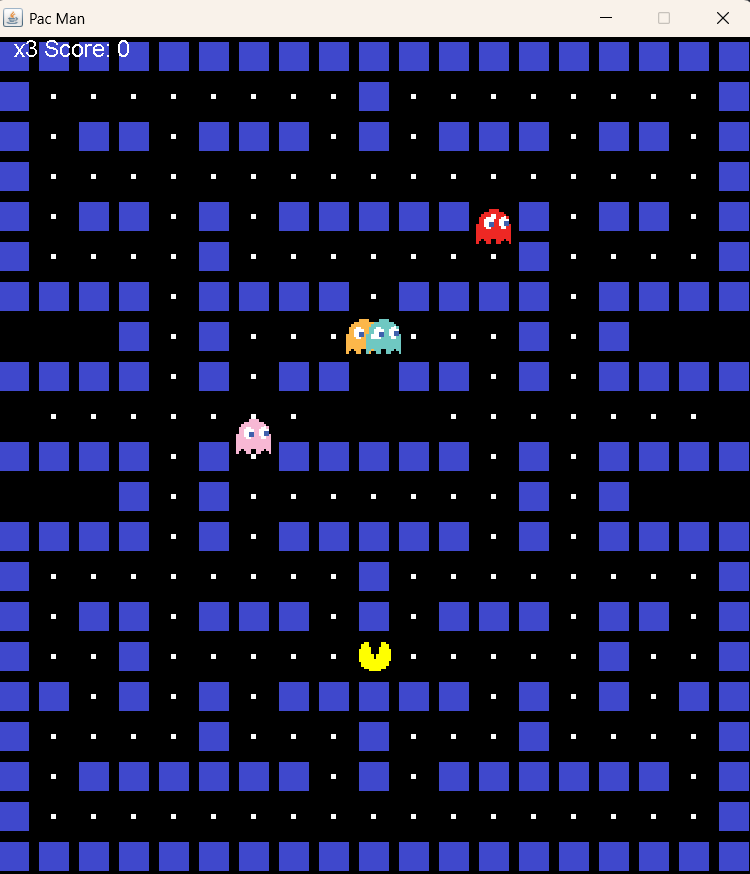

# PacMan
A pacman game made using Java's swing features and awt. 

A pacman character is controlled using the arrow keys on the user's computer. 
The ghosts moves are randomised.
Utilises hashset for object creation and an array with the tilemap for the map.
Game ends either after all the food has been consumed by the pacman character,
or if the pacman character collides with the ghosts 3 times.
Score is calculated based on how many food pellets pacman consumes. 10 points for one.

Visual :

